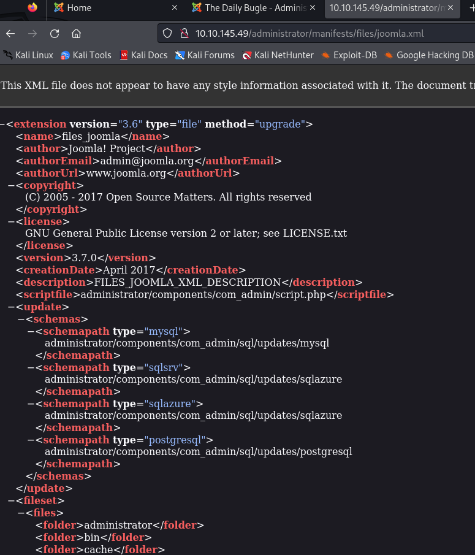

# Write-Up Title

## Table of Contents
1. [Introduction](#introduction)
2. [Methodology](#methodology)
3. [Results](#results)
4. [Analysis](#analysis)
5. [Conclusion](#conclusion)
6. [References](#references)

## Introduction
Provide a brief introduction to the topic of your write-up.

## Methodology
Outline the methods and techniques used to conduct your analysis or investigation.

<u>Recon:</u>

```nmap -sC -oN dailybugle.nmap ip.ad.dre.ss:```

Under the http section, we can start looking at the paths specific to joomla that will give us the version info.
https://docs.joomla.org/Administrator_(Application)



## Results
Present the results obtained from your analysis or investigation.

## Analysis
Discuss and analyze the findings from your results.

## Conclusion
Summarize the key findings and outcomes of your analysis or investigation.

## References
Provide references and links to relevant sources used in your write-up.

---

**Note:** This report is for informational purposes only and does not constitute professional advice.

For more information, visit [example.com](https://example.com){:target="_blank"}.


