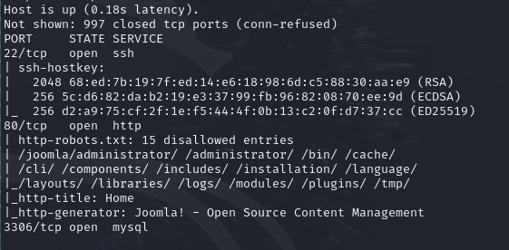
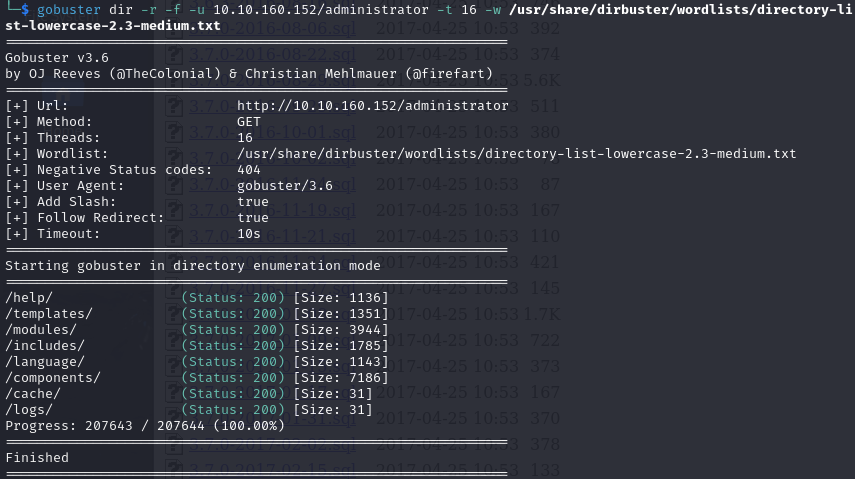
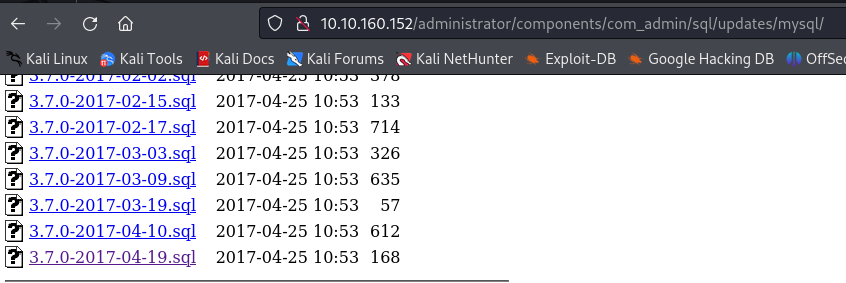
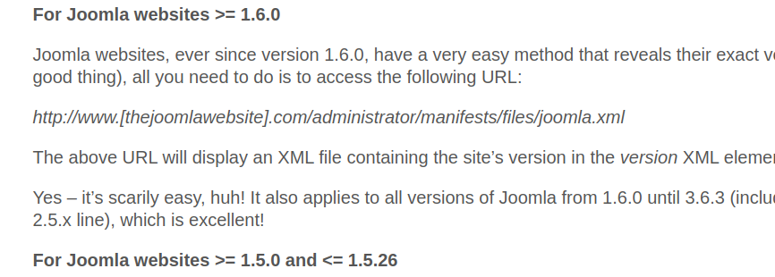

# Write-Up Title

## Table of Contents
1. [Introduction](#introduction)
2. [Methodology](#methodology)
3. [Results](#results)
4. [Analysis](#analysis)
5. [Conclusion](#conclusion)
6. [References](#references)

## Introduction
Provide a brief introduction to the topic of your write-up.

## Methodology

<u>Recon:</u>

```nmap -sC -oN dailybugle.nmap ip.add.re.ss:```



Under the http-robots section, we can start gaining more information about the target by looking at all paths.

The ```/administrator``` path gives us a Joomla backend login portal:


Ok, let's see what additional information is available at this path using ```gobuster```, replacing '-t COUNT' with the number of threads you wish to use:

```gobuster dir -r -f ip.add.re.ss/administrator -t COUNT -w path/to/wordlist```



It is possible to find the version of Joomla in at least two different ways:

1. following the rabbit-hole, starting at the administrator path: 

    

2. searching for "how to find the version of a joomla website":

    Credit: [itoctopus.com](https://www.itoctopus.com/how-to-quickly-know-the-version-of-any-joomla-website){:target="_blank"}.

    

    ... led me to:

    


## Results
Present the results obtained from your analysis or investigation.

## Analysis
Discuss and analyze the findings from your results.

## Conclusion
Summarize the key findings and outcomes of your analysis or investigation.

## References
Provide references and links to relevant sources used in your write-up.

---

**Note:** This report is for informational purposes only and does not constitute professional advice.

For more information, visit [example.com](https://example.com){:target="_blank"}.


