# Image Sequence - Chronological Order

Author: @HuskyHacks

Not bad gophers, but that one was the easiest of the three! How will you do against something a little more involved? I wouldn't expect to get any help from debugging symbols on this one...

## tl;dr
This challenge was enjoyable in many ways and while the author notes that we should not expect any help with dubugging symbols, if you have the right analyzer, a lack of debugging symbols is not a concern. The flag is attainable by setting the win condition by weakening your enemies. Lets begin:

Start by downloading the binary, making note of the submission guidelines:

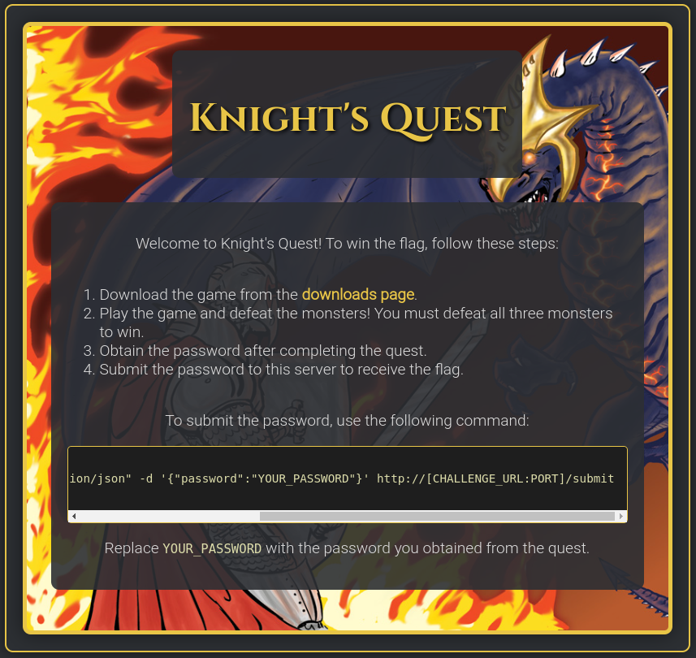  

Running the binary to get a feel for what is happening, making note of any values to look for when we jump into to decompiled binary. As the game progresses through each stage, the health and damage of each enemy is displayed, with each attack coming at the cost of our player's health.

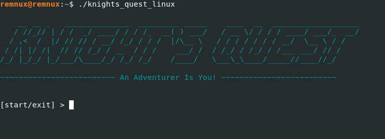  

  

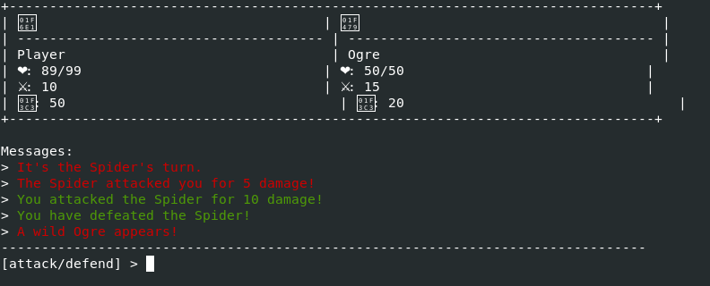  

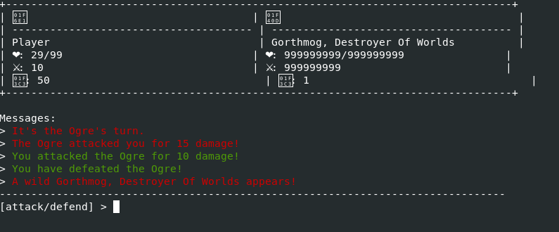  

The final boss is undefeatable given the current game settings. Lets change that!

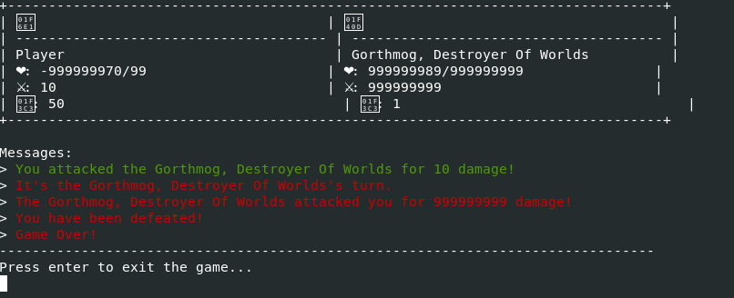  

From the previous, unaltered play, we see the enemies and their corresponding health and attack values (hex). 

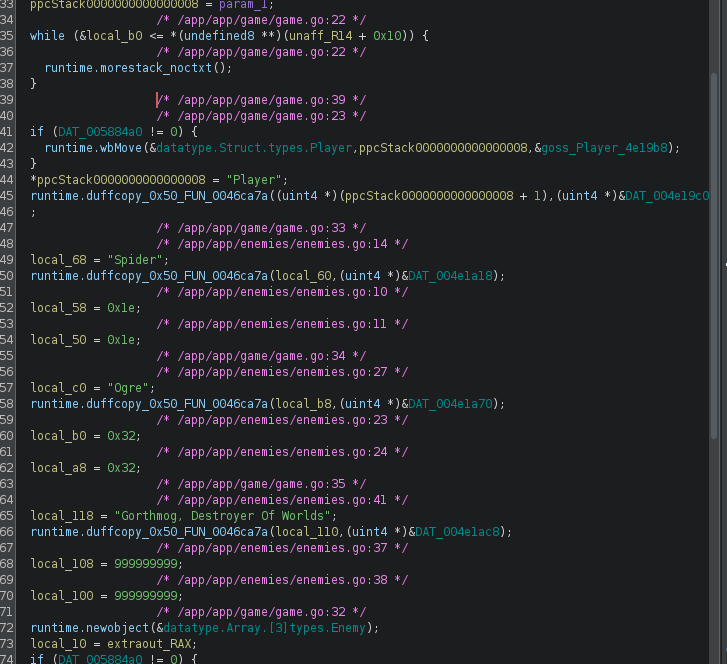  

If we patch values, getting to the win condition becomes easy.

- 0x1e, 0x32, 0x3b9ac9ff

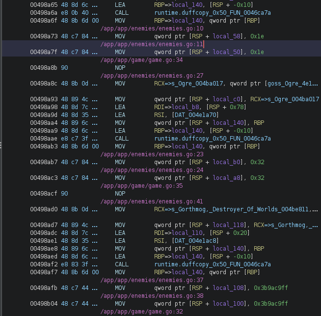  

Patch those values corresponding to enemy health, and optionally their attack values.

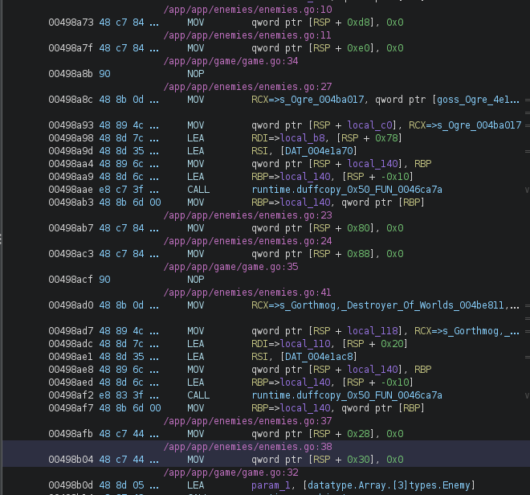  

- 0x0, 0x0, 0x0

Export as a binary.

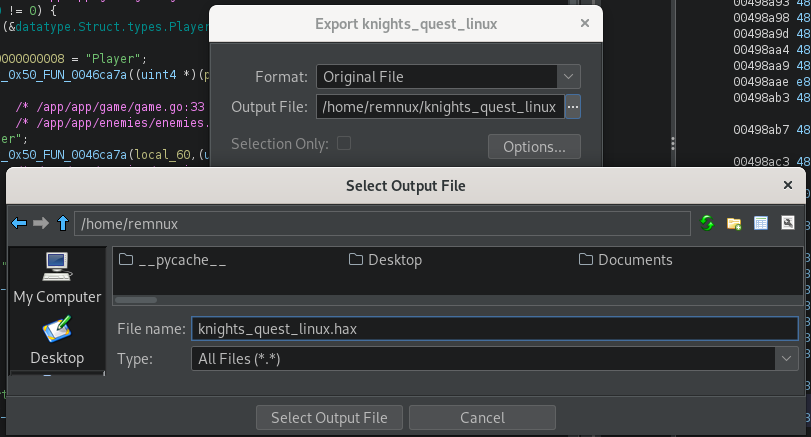 

Begin the game under these new conditions to reach the winning condition.

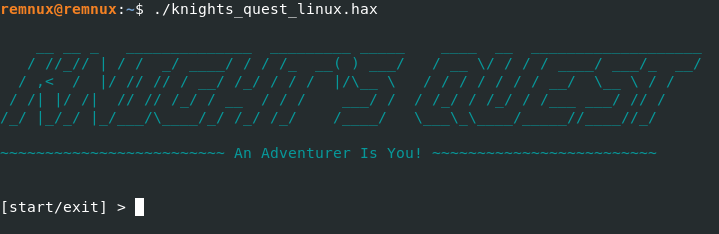  

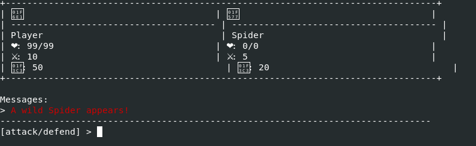  

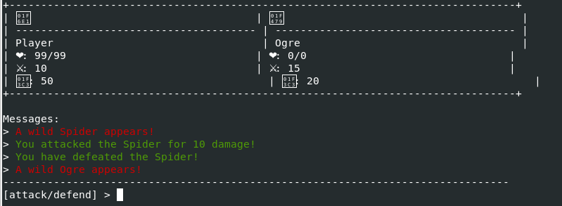  

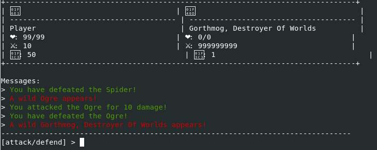  

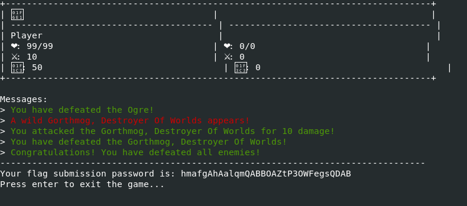  

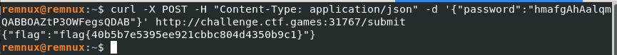  

## Conclusion

What are methods to mitigate this vulnerability? Sure, stripping your binaries creates more 'work' but as you have seen, that is something that can be overcome. Avoiding using static values in your code would be the first step in keeping your binary safe from simple modification. The other way would be to create a checksum before the game begins and compare that the the ending conditions but even that comes with the possibility of being broken. I will leave this as food for thought and would love to hear your thoughts. Thanks for reading! 
