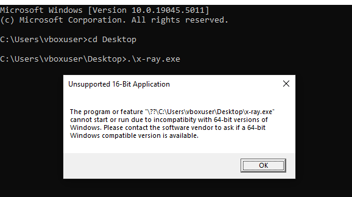
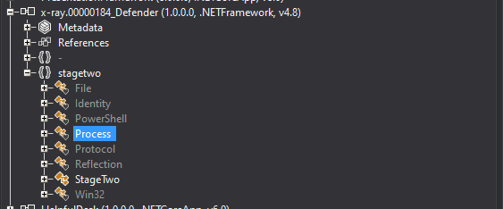
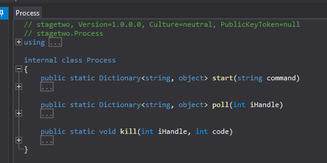
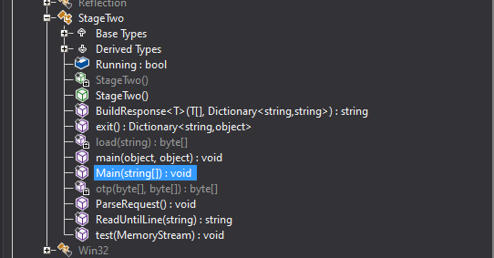
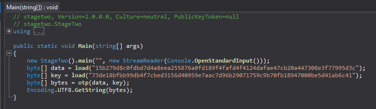

```python
key = "73de18bfbb99db4f7cbed3156d40959e7aac7d96b29071759c9b70fb18947000be5d41ab6c41" 
val = "15b279d8c0fdbd7d4a8eea255876a0fd189f4fafd4f4124dafae47cb20a447308e3f77995d3c"

if len(key) == len(val):
    key = bytes.fromhex(key)
    val = bytes.fromhex(val)
    flag = bytes([k ^ v for k, v in zip(key,val)])
    flag = flag.decode('ascii')
    print(flag)
```

```bash
$ python solvexray.py
flag{df26090565cb329fdc8357080700b621}
```
# Image Sequence - Chronological Order

Below is a sequence of PNG images sorted by their timestamps. Each image is embedded in the order it was created.

  
*Created: Nov 3, 14:52*

  
*Created: Nov 3, 14:53*

  
*Created: Nov 3, 14:53*

  
*Created: Nov 3, 14:53*

  
*Created: Nov 3, 14:54*

