# Web
Author: @HuskyHacks

Need a quick solution for archiving your business files? Try Zippy today, the Zip Archiver built for the small to medium business!

# Image Sequence

Below is a sequence of PNG images sorted by their timestamps. Each image is embedded in the order it was created.

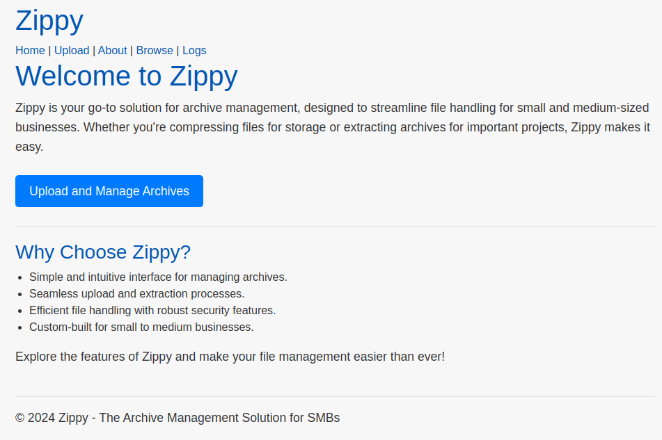  
*Created: Nov 3, 09:37*

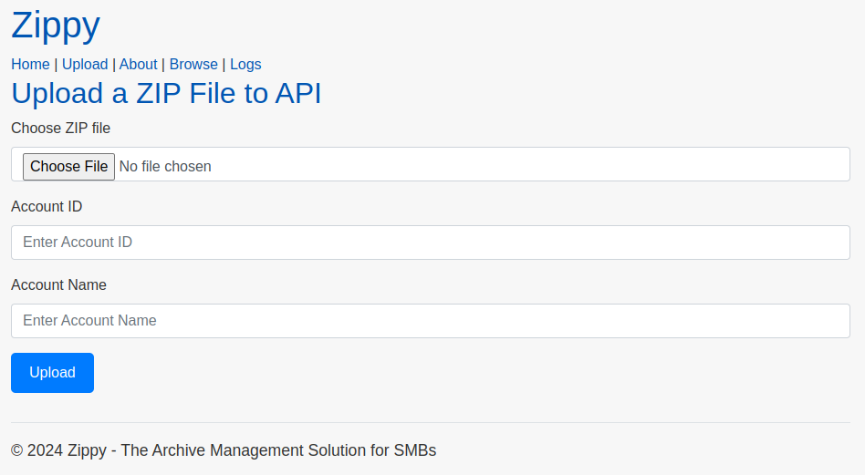  
*Created: Nov 3, 09:37*

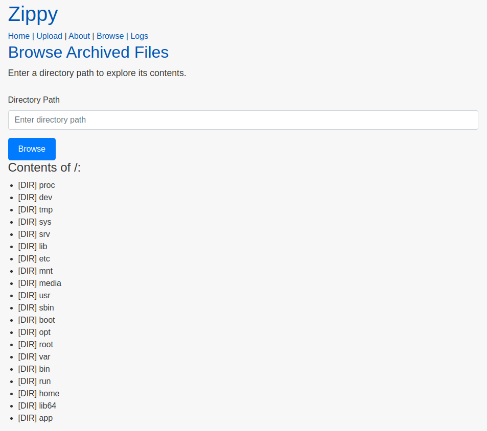  
*Created: Nov 3, 09:38*

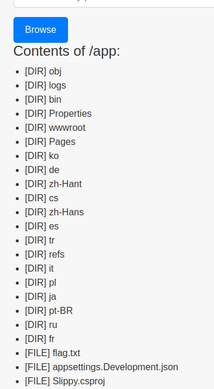  
*Created: Nov 3, 09:40*

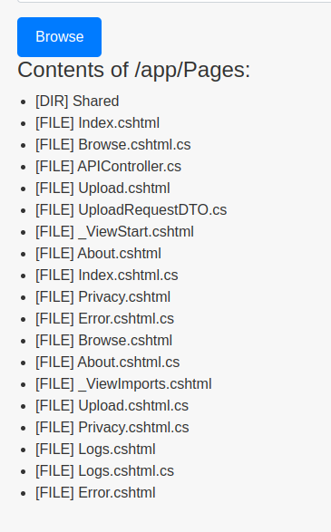  
*Created: Nov 3, 09:41*

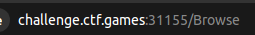  
*Created: Nov 3, 09:42*

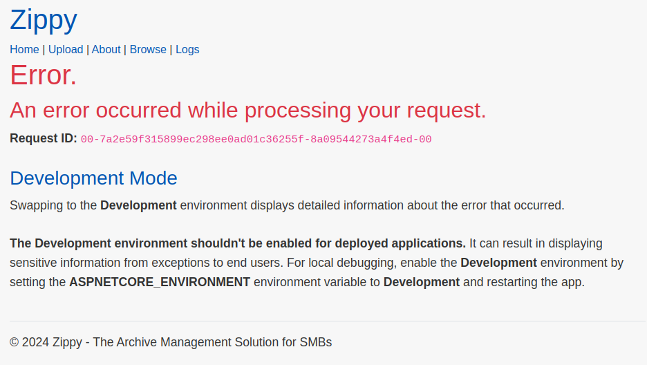  
*Created: Nov 3, 09:42*

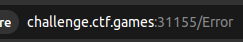  
*Created: Nov 3, 09:43*

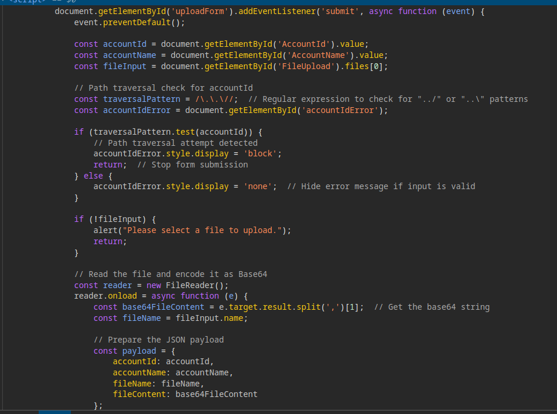  
*Created: Nov 3, 09:48*

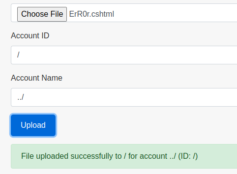  
*Created: Nov 3, 09:51*

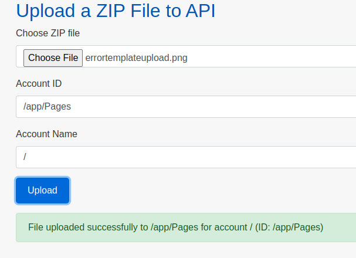  
*Created: Nov 3, 10:06*

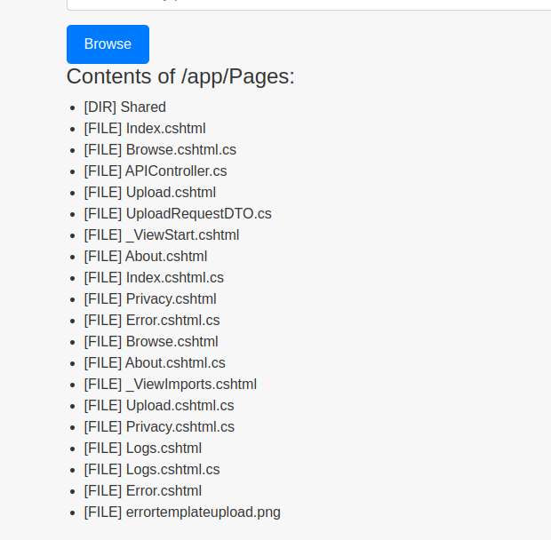  
*Created: Nov 3, 10:07*

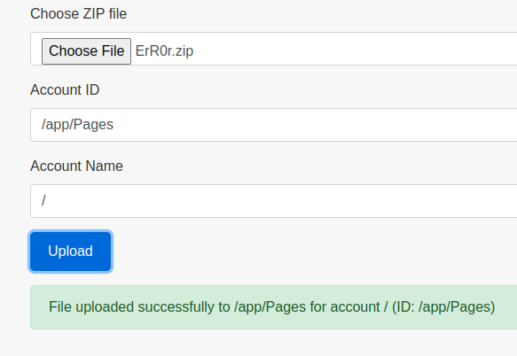  
*Created: Nov 3, 10:08*

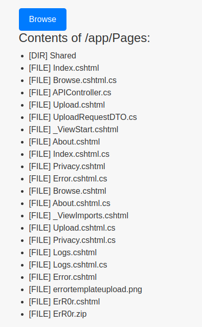  
*Created: Nov 3, 10:08*

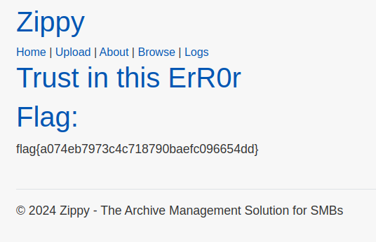  
*Created: Nov 3, 10:09*

  
*Created: Nov 3, 10:10*

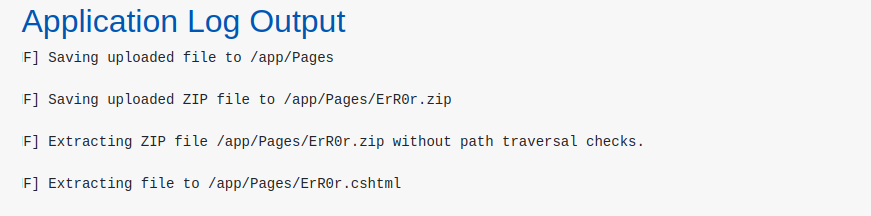  
*Created: Nov 3, 10:12*

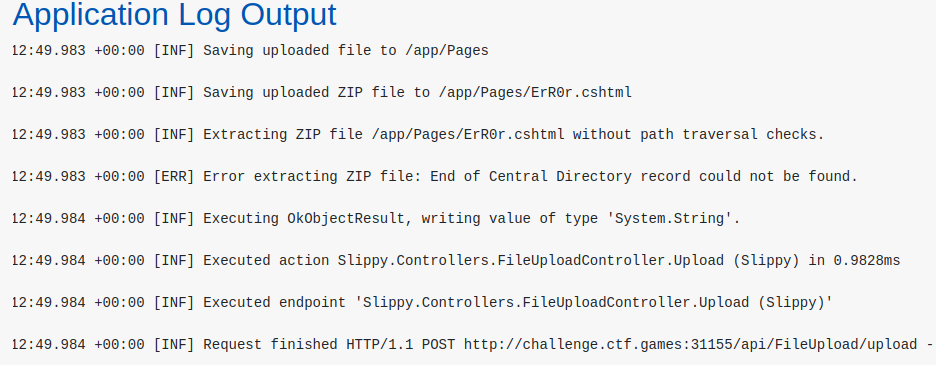  
*Created: Nov 3, 10:15*

zip -r ErR0r.zip ErR0r.cshtml
